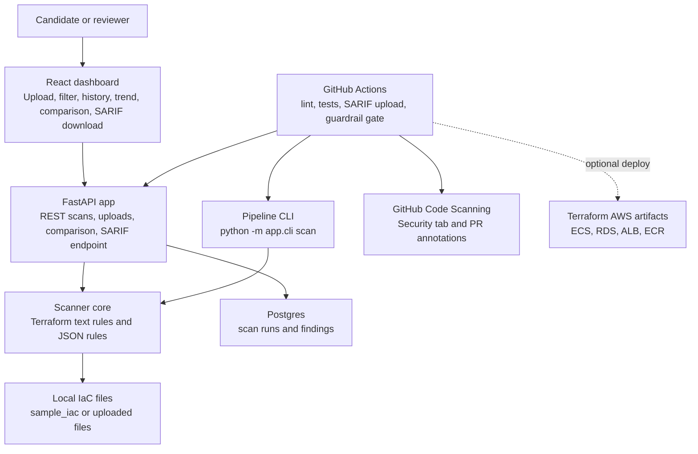

# Andela Enterprise Security Guardrail Auditor

Python-based, API-first security guardrail auditor for the Andela New Hire Challenge. The app scans Terraform and JSON infrastructure files for risky patterns, stores scan results in Postgres, and renders a dashboard with a visual risk score.

Local development is intentionally Docker Compose based. Optional AWS deployment is defined through Terraform and GitHub Actions and should only run with explicitly configured AWS credentials.

## Stack

- FastAPI for the API and dashboard server
- React and Vite for the dashboard frontend
- styled-components for component-scoped styling
- Postgres for scan history and findings
- SQLAlchemy for persistence
- Alembic for database schema migrations
- Docker Compose for local app and database startup
- Pytest for scanner tests
- Playwright for frontend browser tests
- Ruff and ESLint for backend and UI linting
- Terraform and GitHub Actions for optional AWS deployment

## Architecture

The scanner core is shared by the FastAPI application, dashboard workflows, SARIF export, and the CI-focused CLI gate.



Architecture decisions are documented in [docs/adr](docs/adr/README.md), including local-only delivery, Postgres over SQLite, focused pattern scanning over a full HCL parser, the API/CLI/SARIF interface split, and the normalized risk score model.

## Coding Agent And Model

- Coding agent: OpenAI Codex, running in the Codex desktop app.
- Model used: GPT-5.5
- Workflow: the coding agent generated and edited the application code, maintained `prompts.md`, updated documentation, ran verification commands, and published the repository.

## Run Locally

```bash
docker compose up --build
```

Open:

- Dashboard: http://localhost:8000
- React dev dashboard with auto-refresh: http://localhost:5173/static/frontend/
- API docs: http://localhost:8000/docs
- DB-aware health check: http://localhost:8000/health

The dashboard supports severity color coding, a color-coded percentage score (green above 90, amber from 70 to 90, red below 70), risk-score-over-time trend, scan-to-scan regression comparison, clickable severity filters, breadcrumbs for the active severity filter, a clear-filter action, findings search, sortable table headers, horizontal findings-table scrolling, paginated result rows, SARIF export for the selected scan, and clickable recent scan history with scan timestamps in a desktop right-side history rail.

Risk scores use a normalized weighted model: critical, high, medium, and low findings contribute different weights, and the result is normalized by files scanned and distinct affected resources. See [ADR 0005](docs/adr/0005-normalized-risk-score.md) for the scoring formula and tradeoffs.

The default Compose configuration starts:

- `andela-app` on port `8000`
- `andela-postgres` running Postgres 17 on port `5432`
- `andela-frontend` on port `5173` for Vite hot reload during React development

The API runs Alembic migrations on startup, so local Docker Compose and CI use the versioned schema in `alembic/versions` instead of `Base.metadata.create_all`.

Postgres 17 uses the `postgres17-data` Docker volume. If you previously ran the project with Postgres 16, the old `postgres-data` volume is left untouched because Postgres data directories are not major-version compatible in place. Once you no longer need old local scan history, remove that old volume manually with `docker volume rm andela_postgres-data`.

## Frontend Development

The React dashboard source lives in `frontend/src`. FastAPI serves the compiled Vite output from `app/static/frontend`.

Build the frontend:

```bash
./scripts/build-frontend.sh
```

Run the Vite dev server while the FastAPI app is running:

```bash
npm --prefix frontend run dev
```

Or use Docker Compose for browser auto-refresh when React files change:

```bash
docker compose up frontend
```

Open http://localhost:5173/static/frontend/. The Vite dev server proxies `/api` and `/health` to the Compose `app` service.

## Run A Sample Scan

Use the dashboard button, or call the API:

```bash
curl -X POST http://localhost:8000/api/scans/sample
```

List scan history:

```bash
curl http://localhost:8000/api/scans
```

Export a persisted scan as SARIF 2.1.0 for GitHub Code Scanning:

```bash
curl http://localhost:8000/api/scans/1/sarif \
  -H "Accept: application/sarif+json" \
  -o andela-guardrail-auditor.sarif
```

Compare two persisted scans for new and resolved findings:

```bash
curl "http://localhost:8000/api/scans/compare?base_scan_id=1&head_scan_id=2"
```

Scan a path under the configured local scan root:

```bash
curl -X POST http://localhost:8000/api/scans \
  -H "Content-Type: application/json" \
  -d '{"path":"sample_iac","label":"Sample IaC scan"}'
```

Upload one or more infrastructure files and scan them without writing them to disk:

```bash
curl -X POST http://localhost:8000/api/scans/upload \
  -F "label=Uploaded IaC scan" \
  -F "files=@sample_iac/scenarios/both_risky/terraform/main.tf" \
  -F "files=@sample_iac/scenarios/json_only/risky_cloudformation.json"
```

## Pipeline Guardrail CLI

Run the scanner without starting the API or database:

```bash
python -m app.cli scan sample_iac/ --fail-on critical
```

The CLI exits `1` when any finding meets or exceeds the configured severity threshold. The CI workflow runs this command before Docker build, so critical findings block the build.

## Sample Infrastructure Fixtures

The `sample_iac/scenarios` folder contains Terraform and JSON CloudFormation-style files used by the scanner and tests:

- `both_risky`: Terraform and JSON files both contain risky patterns.
- `terraform_only`: Terraform contains risky patterns; JSON is clean.
- `json_only`: JSON contains risky patterns; Terraform is clean.
- `clean`: Terraform and JSON files are both configured safely.
- `large_violations`: Terraform and JSON contain a large synthetic finding set for search, filtering, and pagination testing.

The sample findings cover public SSH ingress, hardcoded credentials, AWS access key patterns, public S3 ACLs, wildcard IAM policies, disabled database encryption, and suspended S3 versioning.

Rule metadata and rule check functions are registered once in `app.scanner.RULES`. Scanner findings, `/api/rules`, and SARIF rule metadata all read from that registry to avoid drift.
Secret findings redact evidence before persistence, dashboard display, CLI output, and SARIF export.

## Run Tests

```bash
python3 -m venv .venv
source .venv/bin/activate
pip install -r requirements-dev.txt
```

Use the scripts directory to run linting and test scopes:

```bash
./scripts/lint-project.sh
./scripts/lint-all.sh
./scripts/lint-backend.sh
./scripts/lint-frontend.sh
./scripts/test-unit.sh
./scripts/test-functional.sh
./scripts/test-playwright.sh
./scripts/test-all.sh
```

The functional and full test scripts build the React frontend before running FastAPI tests. `test-all.sh` also runs the Playwright browser suite after the Python tests. The test suite includes scanner and CLI unit tests for each fixture scenario and threshold exit codes, FastAPI functional tests for scan creation, scan comparison, scan history, scan detail lookup, SARIF export, dashboard serving, rules metadata, missing paths, and scan-root path safety, plus Playwright coverage for the React dashboard empty/loading/error states, sample scan, score trend, scan comparison, score color thresholds, severity filtering, breadcrumbs, search, sorting, horizontal table scrolling, pagination, SARIF download, uploads, scan history, desktop history placement, and mobile-width usability.

The Playwright config uses the local Vite dev server and mocked API responses for deterministic frontend coverage. It uses system Chrome by default; set `PLAYWRIGHT_USE_SYSTEM_CHROME=0` if you want to run with Playwright-managed browsers after installing them.

## GitHub Actions CI/CD

The workflow in `.github/workflows/ci-cd.yml` runs on pull requests and pushes to `dev`.

It performs:

- Backend linting with Ruff and Python compile checks.
- Python unit and functional tests.
- UI linting with ESLint.
- React production build.
- Playwright browser tests.
- Terraform formatting and validation.
- SARIF generation from a sample scan and upload to GitHub Code Scanning with `github/codeql-action/upload-sarif`.
- Guardrail CLI scanning of `sample_iac/` with `--fail-on critical` before Docker build.
- Docker image build.

Dependabot is configured in `.github/dependabot.yml` to create one weekly grouped dependency update pull request against `dev`. The grouped PR covers npm, pip, Docker, Terraform, and GitHub Actions dependencies and is scheduled for Monday at 09:00 Europe/Dublin time.

AWS deployment runs from the `dev` branch when the required repository variables are configured. The deploy job uses GitHub OIDC to assume an AWS role, initializes Terraform with an S3 backend, ensures the ECR repository exists, builds and pushes the Docker image, then applies the ECS/RDS/ALB infrastructure.

A separate manual workflow, `.github/workflows/deploy-terraform.yml`, runs Terraform deployment independently of the app image build. It always performs `fmt`, S3 backend initialization, validation, and planning. Set its `apply` input to `true` to apply the plan, and provide `container_image` when the ECS task definition should point at a specific pre-built image.

Required GitHub repository variables for deployment:

- `AWS_ROLE_TO_ASSUME`: IAM role ARN trusted by GitHub OIDC.
- `AWS_REGION`: AWS region, for example `us-east-1`.
- `TF_STATE_BUCKET`: pre-created S3 bucket for Terraform state.
- `TF_STATE_LOCK_TABLE`: pre-created DynamoDB table for Terraform state locking.

Optional GitHub repository variables:

- `TF_STATE_KEY`: defaults to `andela/terraform.tfstate`.
- `PROJECT_NAME`: defaults to `andela-guardrail-auditor`.
- `DEPLOY_ENVIRONMENT`: defaults to `dev`.
- `ALLOWED_INGRESS_CIDR`: defaults to `0.0.0.0/0`; narrow this for non-demo deployments.
- `CONTAINER_IMAGE`: fallback image URI for the manual Terraform deploy workflow when no `container_image` input is supplied.

## Terraform

Terraform lives in `terraform/` and provisions:

- ECR repository for application images.
- VPC, public subnets, internet gateway, and route tables.
- Application Load Balancer.
- ECS Fargate cluster, task definition, and service.
- RDS Postgres for scan history.
- Secrets Manager secret for the application `DATABASE_URL`.
- IAM roles and CloudWatch logging.

Terraform state is configured through the S3 backend in `terraform/versions.tf`. Use `terraform/backend.example.hcl` as a template for local initialization if needed:

```bash
cp terraform/backend.example.hcl terraform/backend.hcl
terraform -chdir=terraform init -backend-config=backend.hcl
```

Do not commit `terraform/backend.hcl` because it contains environment-specific state backend settings.

## Challenge Submission Notes

Include these artifacts in the final submission:

- Tagle output summary: Connector - Foundation Operator
- Public GitHub repository link
- `prompts.md` audit log
- Architecture decision records in `docs/adr/` and the README component diagram
- AI-generated presentation deck, created after the code is complete
- Cloud cleanup confirmation: no cloud resources were created from the local agent workspace; AWS deployment runs only through configured GitHub Actions and Terraform.
