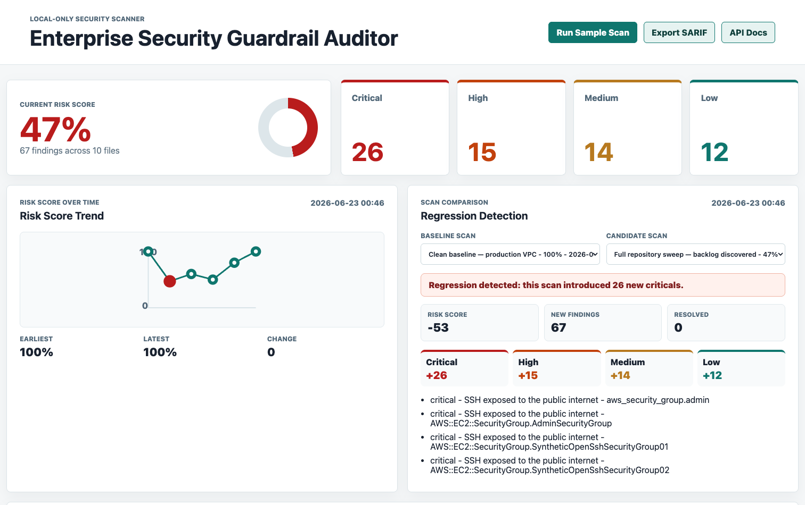
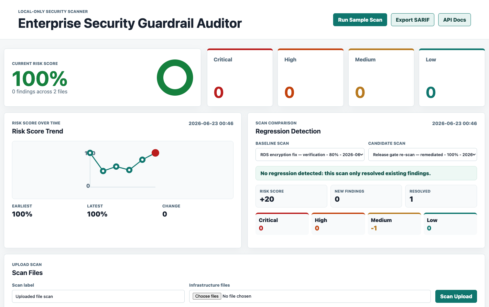
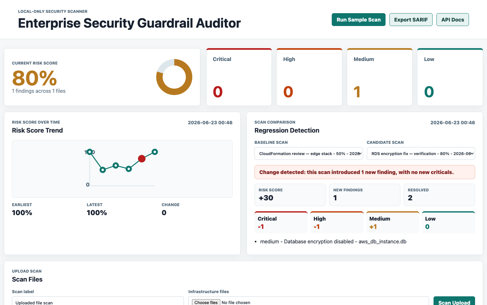
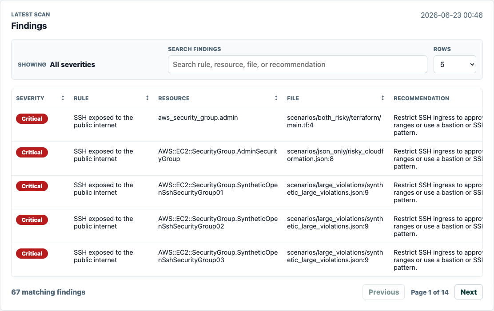
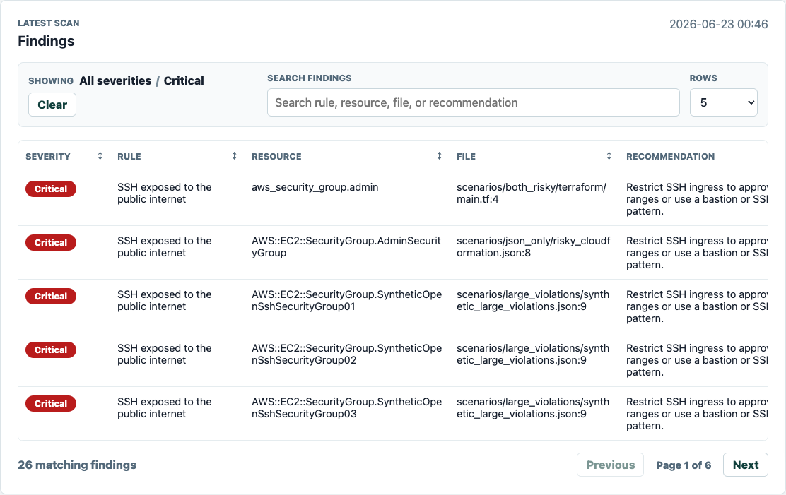
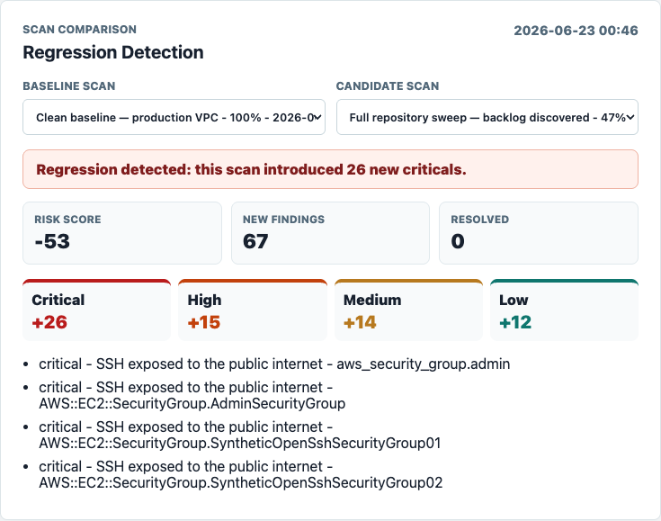
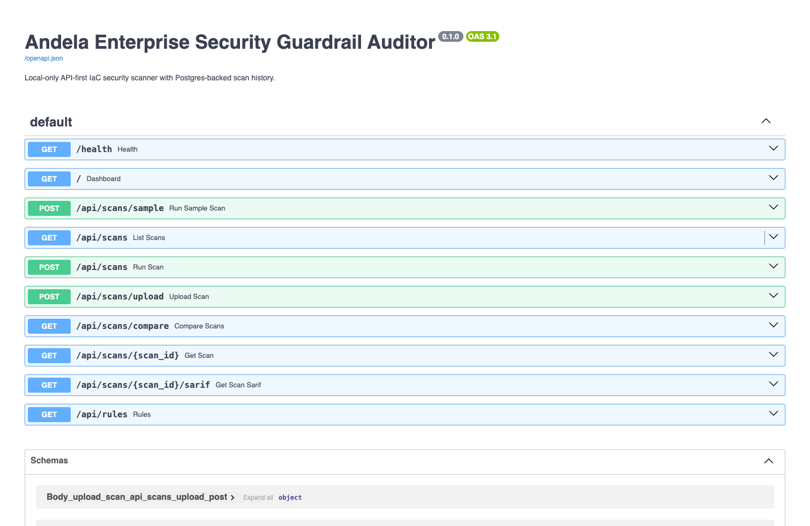
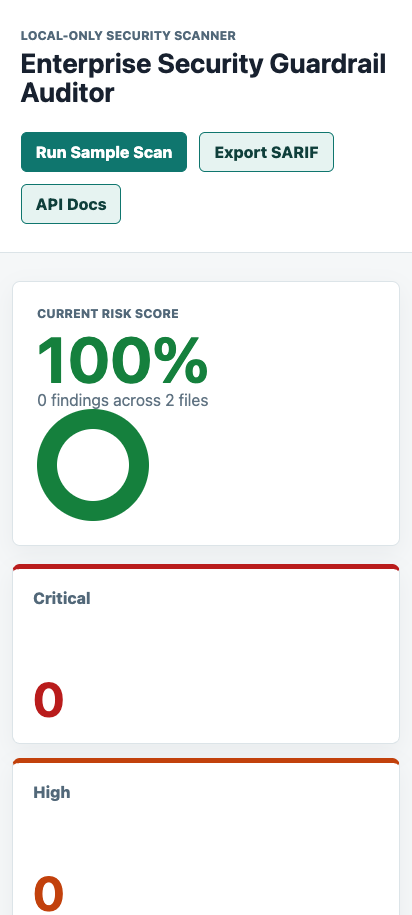

<!-- _class: lead -->
<!-- _paginate: false -->

### Andela Graduate “Vibe Coding” Challenge · Project 2

# Enterprise Security<br>Guardrail Auditor

#### Shift-left security scanning for Infrastructure-as-Code

<span class="pill">Tagle Tag · Connector — Foundation Operator</span>

**Damien Gallagher**  ·  `github.com/damogallagher/andela`

---

<!-- _class: divider -->
<!-- _paginate: false -->

<span class="big">01</span>

### Act one

# The mandate

A *“Vibe Coding”* exercise: I hold the architectural vision, the AI agent writes every line.

---

## I architect, the AI engineers

This was built under a strict, auditable workflow:

1. **Human-in-the-loop architect.** I set the vision, constraints and acceptance criteria; the AI agent wrote **100% of the code** — no manual edits.
2. **Auditable by design.** Every instruction is logged in `prompts.md` — **58 prompts** forming a complete trail from scaffold to production-ready.
3. **One agent, end-to-end** for architectural consistency across every layer.
4. **Time-boxed delivery** — a 4–6 hour MVP target, shipped as a public repo, a full prompt log, and this deck.

> My value was not syntax — it was **directing the system**: the architecture, the interfaces, the quality bar, and the trade-offs.

---

## Breaches come from misconfiguration

Most cloud incidents are not zero-days — they are risky settings that ship in Terraform and CloudFormation **before** anything reaches the cloud:

- 🔓 Security groups exposing **SSH (22) to `0.0.0.0/0`**
- 🪣 **Public S3 buckets** and suspended versioning
- 🔑 **Wildcard IAM** policies (`Action:*` on `Resource:*`)
- 🗝️ **Hardcoded credentials** / AWS keys committed to IaC
- 💾 **Unencrypted databases** and missing backups

**The cheapest place to catch them is the pull request — not production.**

---

<!-- _class: divider -->
<!-- _paginate: false -->

<span class="big">02</span>

### Act two

# The solution

A Python, API-first guardrail auditor — one scanner core serving humans and pipelines alike.

---

## A guardrail auditor for humans and pipelines

A **Python, API-first** auditor that scans IaC against a security baseline and presents a **visual Risk Score**.

| | |
|---|---|
| **Scans** | Terraform (`.tf`) + JSON / CloudFormation |
| **Detects** | 100+ AWS / Azure signatures across 9 control families |
| **Scores** | Normalized 0–100 risk health, color-coded |
| **Persists** | Postgres-backed scan history & audit trail |
| **Surfaces** | Dashboard · REST API · CLI gate · SARIF |

**Local-first by design** — runs entirely on Docker Compose. AWS infrastructure is fully authored in Terraform but **never auto-provisions**, honoring the challenge's no-resources rule.

---

## Who uses it — five use cases

1. **PR / pre-merge gate** — `--fail-on critical` blocks risky infra in CI before merge.
2. **Developer self-service** — engineers upload a `.tf` / `.json` and see findings + fixes instantly.
3. **GitHub Code Scanning** — SARIF export lights up the Security tab and PR annotations.
4. **Compliance audit trail** — every scan is persisted in Postgres with timestamps as evidence.
5. **Regression detection** — compare two scans to prove a change *introduced* (or *resolved*) risk.

---

## Architecture — one core, four interfaces

A **framework-independent scanner core** is reused by every interface; no rule logic is duplicated.

```
                 ┌──────────────────────────────┐
   Reviewer ───▶ │  React Dashboard (Vite)       │
                 │  upload · filter · trend · SARIF│
                 └───────────────┬───────────────┘
                                 │ REST
   CI Pipeline ──┐               ▼
                 │      ┌───────────────────┐      ┌──────────────┐
  python -m      ├────▶ │   FastAPI app     │────▶ │  Postgres    │
  app.cli scan   │      │   (scans, SARIF)  │      │ scans+find.  │
                 │      └─────────┬─────────┘      └──────────────┘
                 │                ▼
                 │      ┌───────────────────┐
   GitHub ───────┴────▶ │   Scanner core    │◀── sample_iac / uploads
   Actions              │ TF rules·JSON rules│
                        └───────────────────┘
```

Rule logic lives once in `app.scanner.RULES` — reused by dashboard, API, CLI, tests and SARIF. Five trade-offs are recorded as **ADRs** in `docs/adr/`.

---

<!-- _class: divider -->
<!-- _paginate: false -->

<span class="big">03</span>

### Act three

# The product

A polished React dashboard that makes infrastructure risk legible at a glance.

---

## The Risk Score, color-coded

Thresholds make risk legible instantly: **green > 90 · amber 70–90 · red < 70**.



<span class="muted">A high-risk scan: **47%**, 67 findings across 10 files — severity breakdown and a regression alert in one view.</span>

---

## Green & amber score states

 

**Left:** a clean baseline scores **100% (green)**. **Right:** a single medium finding scores **80% (amber)** — the normalized model never collapses to zero on small scans.

---

## Findings management



Every finding carries **rule, severity, affected resource, `file:line`, and a remediation recommendation**. Search, sortable columns, configurable rows and pagination handle large result sets (67 findings → 14 pages).

---

## Filtering & regression detection

 

**Left:** click a severity card to filter, with breadcrumb + clear. **Right:** scan-to-scan comparison flags *“introduced 26 new criticals”* — turning history into a guardrail.

---

## API-first & responsive

 

Auto-generated **OpenAPI 3.1 docs** for every endpoint (scans, upload, compare, SARIF, rules, health). The dashboard is fully **responsive** — verified on mobile Chromium.

---

## Feature catalogue

**Scanning**
100+ AWS/Azure signatures across 9 control families · single **rule registry** (`app.scanner.RULES`) feeds scanner, `/api/rules` *and* SARIF (zero drift) · **secret redaction** before persistence, display, CLI and SARIF.

**Dashboard**
Color-coded score · severity cards & filtering · breadcrumbs · search · sortable headers · pagination · clickable history with timestamps · trend chart · regression compare · SARIF download · uploads.

**Interfaces** — React dashboard · REST API (OpenAPI 3.1) · CLI gate for CI · SARIF 2.1.0 for Code Scanning.

---

<!-- _class: divider -->
<!-- _paginate: false -->

<span class="big">04</span>

### Act four

# The engineering

Documented decisions, an automated pipeline, and a tool that is itself fully guarded.

---

## Key decision — an honest risk-scoring model (ADR 0005)

The original `100 − flat_penalty` score had two flaws: it **saturated at 0** (4 vs 10 criticals looked identical) and **ignored scan scope**.

Replaced with a **normalized, severity-weighted density**:

- Weights: critical `10` · high `6` · medium `3` · low `1`
- Scope units: `(files × 2) + distinct affected resources`
- Score = `ceil( 100 · 4·units / (4·units + Σweights) )`

**Asymptotic, not subtractive** — more findings keep lowering the score with no hard floor; any scan with findings caps at 99, so only a clean scan shows 100. Aligns exactly with the green/amber/red thresholds.

---

## Architecture decisions (ADRs)

Every significant trade-off is documented and version-controlled.

| ADR | Decision | Why |
|---|---|---|
| **0001** | Local-only dev & verification | No cloud cost / credential risk; reviewers run it free |
| **0002** | Postgres over SQLite | Mirrors the RDS deployment shape; durable audit trail |
| **0003** | Focused text/JSON scan, no full HCL parser | Small, testable, MVP-appropriate; trade-off documented |
| **0004** | Expose via API + CLI + Dashboard + SARIF | One core, four audiences; CI fails without a web server |
| **0005** | Normalized weighted risk score | Honest density that respects scope and severity |

---

## Automation — a seven-stage CI/CD pipeline

`.github/workflows/ci-cd.yml` runs on every PR & push to `dev`:

1. **Backend** — Ruff lint + Python unit & functional tests (Postgres service)
2. **Code scanning** — generate SARIF → upload to GitHub Code Scanning
3. **Guardrail CLI** — risky fixtures fail & clean fixtures pass on `--fail-on critical`
4. **Frontend** — ESLint + Vite build + **Playwright** (desktop & mobile)
5. **Terraform** — `fmt -check` + `init` + `validate`
6. **Docker build** — only after every gate passes
7. **Deploy** *(gated)* — OIDC → Terraform S3 backend → ECS / RDS / ALB

Plus **Dependabot** (one grouped weekly PR to `dev`) and a **pre-commit** gate mirroring CI.

---

## Quality — the guardrail tool is itself guarded

| | |
|---|---|
| **71** | Python tests passing — scanner · API · CLI · SARIF · migrations · observability |
| **100%** | Statement coverage (841/841) — gated in CI at `--fail-under=100` |
| **36** | Playwright runs — 18 specs across desktop & mobile Chromium |
| **58** | Logged prompts — every instruction captured in `prompts.md` |

```
$ ./scripts/test-coverage.sh
TOTAL      841 stmts      0 missed      100%
71 passed in 2.55s
```

Coverage spans scanner, API, CLI, SARIF, migrations, observability and config — a 100% gate keeps it there.

---

## Cloud — deploy-ready, never auto-applied

Full **Terraform** under `terraform/` provisions a realistic production stack:

- **ECS Fargate** behind an **Application Load Balancer**
- **RDS Postgres** for scan history · **ECR** for images
- **Secrets Manager**, IAM roles, CloudWatch logging
- **State in S3** + DynamoDB lock; auth via **GitHub OIDC** (no long-lived keys)

> **Cloud judgment without cloud cost.** The agent workspace **never** provisions cloud. Deployment runs **only** when explicit repository variables + credentials are configured — honoring the challenge's *“delete all cloud resources”* rule by default, with zero standing spend.

---

<!-- _class: divider -->
<!-- _paginate: false -->

<span class="big">05</span>

### Act five

# The horizon

Where the architecture goes next — each enhancement already has a clear seam.

---

## Future enhancements

- **Deeper Terraform** — swap focused text rules for a real **HCL parser** (modules, variables, dynamic blocks)
- **LLM fallback** — call a model only when deterministic rules find nothing; off by default for free, predictable CI
- **Policy-as-code** — OPA / Rego custom org baselines; rule severities as configuration
- **Alerting** — Slack / webhook on regression or critical findings
- **Multi-tenant + authz** — teams, projects, role-based access control
- **Scheduled scans & analytics** — track risk posture across repositories over time

---

<!-- _class: lead -->

## In summary

A **production-shaped** guardrail auditor, delivered by directing an AI agent end-to-end.

**Submission checklist**
- ✅ Tagle Tag — *Connector, Foundation Operator*
- ✅ Public GitHub repo — all source code
- ✅ `prompts.md` — full 58-prompt audit log
- ✅ This AI-generated deck (PPTX + Markdown)
- ✅ Cloud cleanup — local-only; nothing provisioned

<span class="pill">Python · API-first · Postgres · 100% coverage · CI/CD · SARIF · Terraform</span>

*Thank you.*
